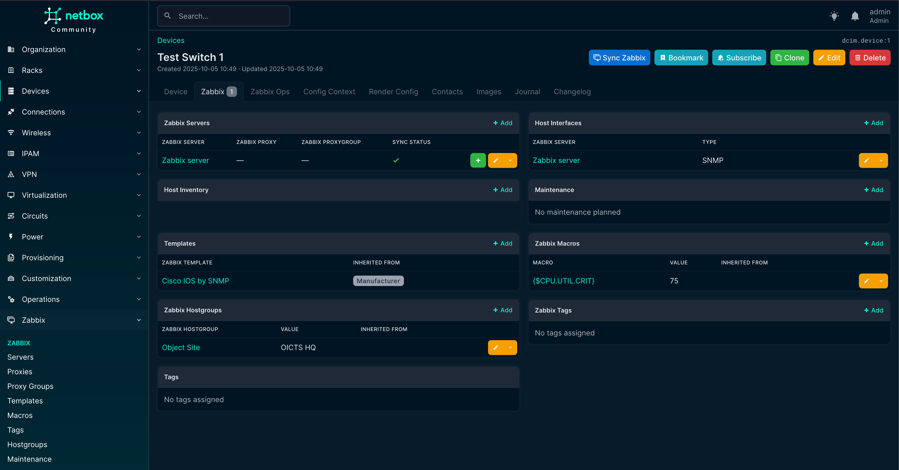
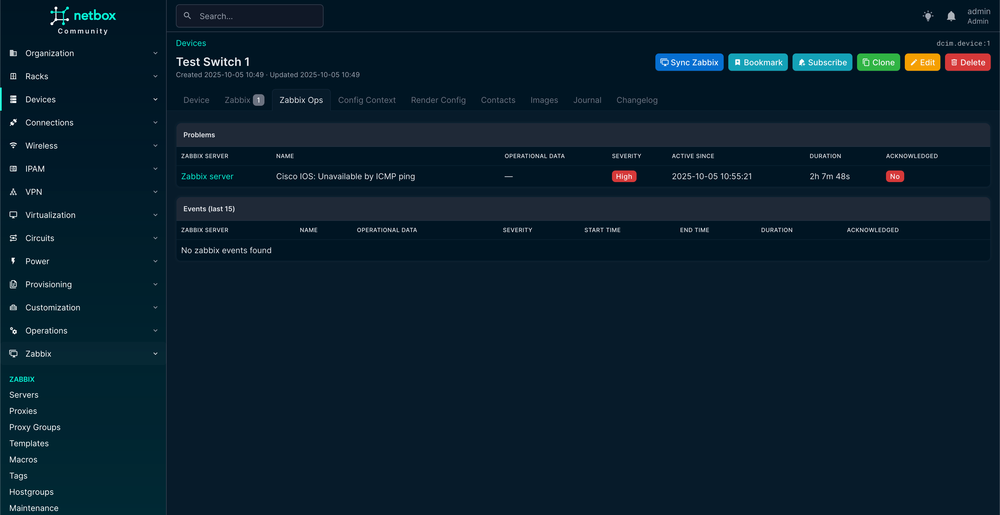

# nbxSync – NetBox ⇄ Zabbix Integration

**Integrate Netbox as Source of Truth with Zabbix as Monitoring Solution**


---

## Description

nbxSync seamlessly integrates Netbox with Zabbix.

With nbxSync you can:
✅ Create and manage all your devices in NetBox (your single source of truth)
✅ Automatically sync devices to Zabbix for monitoring
✅ Save time, reduce errors, and ensure consistent, up-to-date monitoring data

This plugin bridges the gap between network/source-of-truth documentation and infrastructure monitoring – something many teams have been asking for.

💡 If you’re running both NetBox and Zabbix, this is the missing link you’ve been waiting for.

---

## 📦 Installation

### 1. Install the plugin

> [!IMPORTANT]
> The steps below are for a non-dockerized setup. If you run Netbox in Docker containers, please see [their installation instructions](https://netboxlabs.com/docs/netbox/installation/)

Install using pip

```bash
pip install nbxsync
```

### 2. Enable the plugin in `configuration.py`

Add to your `PLUGINS` list:

```python
PLUGINS = [
    'nbxsync',
    # ... other plugins ...
]
```

### 3. Apply migrations and collect static files

```bash
python3 manage.py migrate
python3 manage.py collectstatic
```

### 4. Restart NetBox

```bash
sudo systemctl restart netbox
```

---

## Screenshots


---


---
