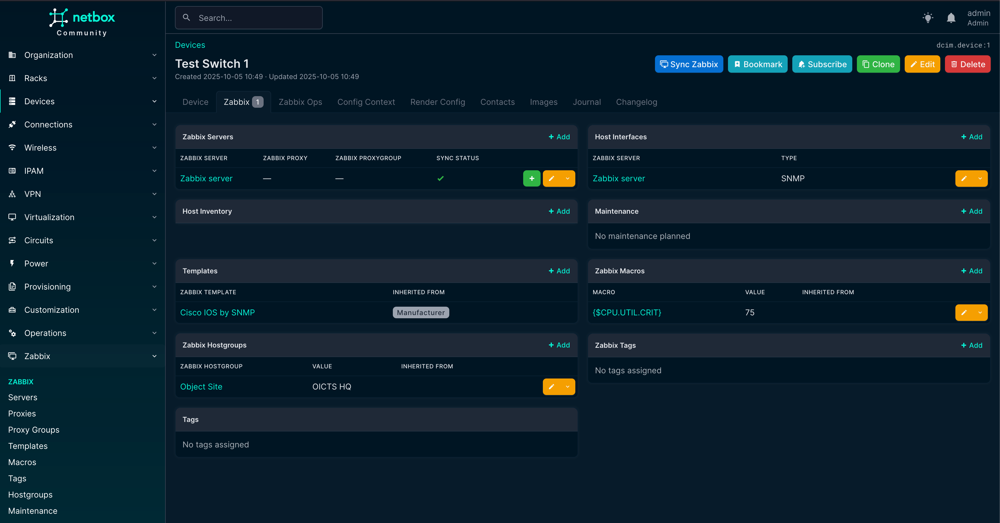
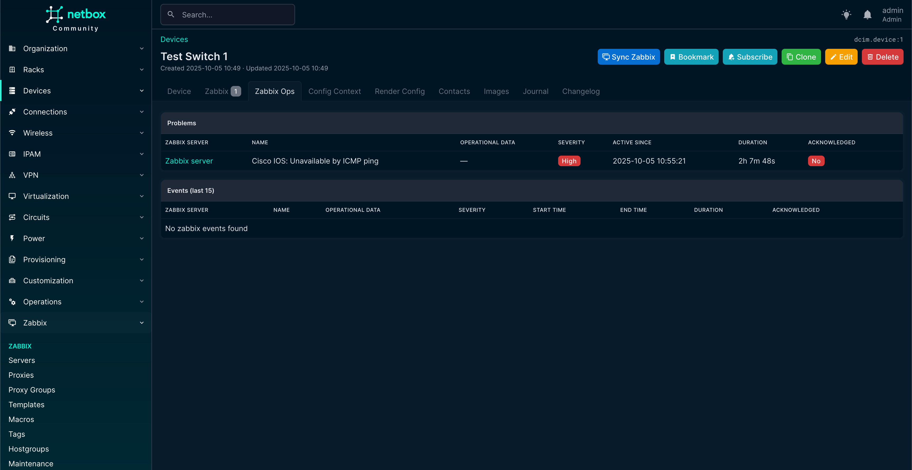

# nbxSync - Netbox ❤️  Zabbix

This plugin integrates [NetBox](https://netbox.dev) with [Zabbix](https://www.zabbix.com/), providing a bridge to synchronize NetBox Devices & VMs into Zabbix Hosts and (limited though) vice versa. Through custom models, these Devices and VMs can be added to custom hostgroups, macro's can be provisioned with dynamic values (based on jinja2) and templates can be assigned on not only the object itself (so the device/vm), but can be inherited from Device Types, Manufacturerer, Device Roles and Platform.

## Features

- Sync Devices and VMs as Zabbix hosts (and back)
- Assign and inherit templates
- Manage macros, host groups, and proxy/proxygroups
- Safe deletion and change tracking
- Job-based execution for controlled syncing
- Hostgroup & Tag values based on Jinja2 templates

Built to make NetBox the single source of truth while leveraging Zabbix for monitoring.
{: .slogan }

## Screenshots

