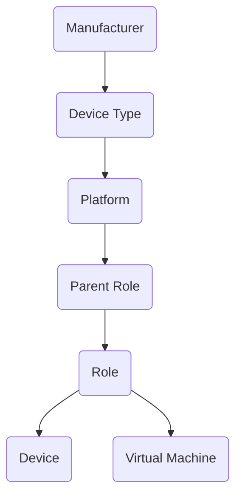

# Philosofy

NetBox contains significantly more contextual information than Zabbix. Beyond just the manufacturer, NetBox tracks details like operating system, location, device role, customer, and more. This makes it an ideal source for enriching Zabbix with metadata that Zabbix itself can't derive. By using NetBox as the foundation, you establish a single, authoritative source of truth for what needs to be monitored. Furthermore, it allows for uniform configuration between similar objects: Cisco devices will always be monitored in the same way. Database servers (as determined by the role) are monitored in the same way - et cetera.

This plugin also enables downward propagation of configuration. For instance, if a host group is assigned at the manufacturer level, that assignment automatically applies to all associated devices. This reduces manual effort and ensures consistent configuration across all hosts from the same manufacturer — including host groups, templates, and other attributes.

Data is always added and inherited downward through the hierarchy. While inherited data can be overridden, it cannot be removed.

The inheritance order is configurable (see [installation instructions](installation.md)), but the *default* sequence is:

